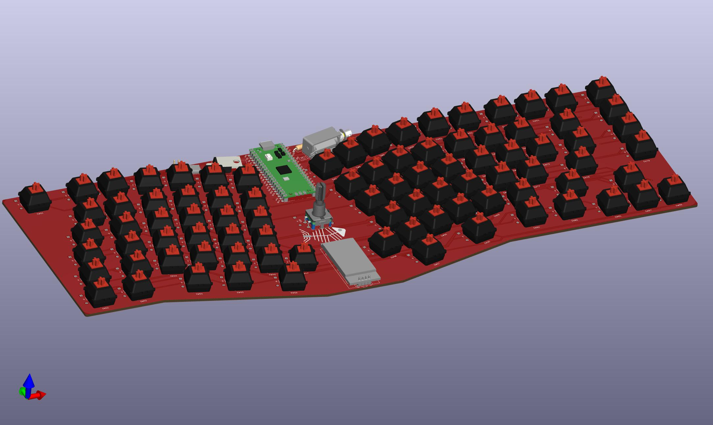
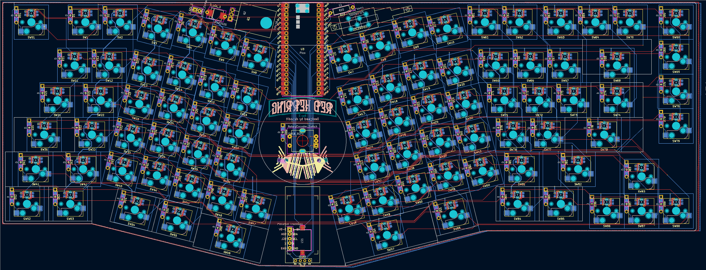
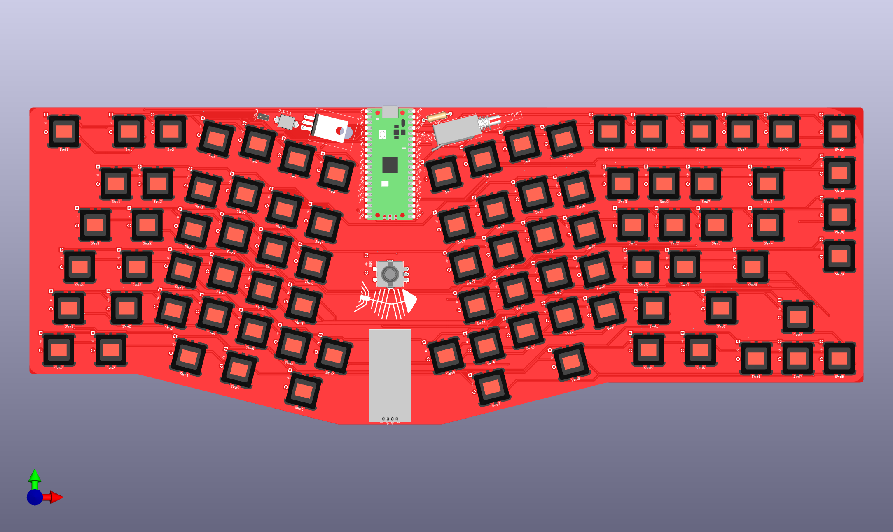
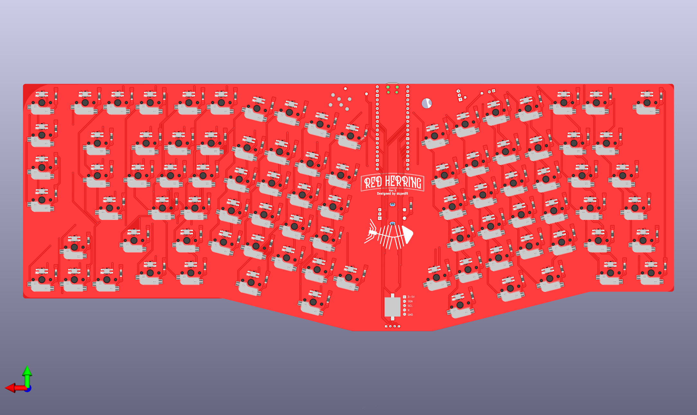

# Redherring V2

## **This board has not been validated and should not be produced.**

## Pi2040 variant intended to reduce cost and build complexity while adding features.

Changes from v1
* Reduced footprint to reduce manufacturing cost. (component showcae removed and pulled in perimeter to 1.5mm from edge of keys).
* MCU is now Raspberry Pi Pico. Pico allows for:
    * Lower cost. (~$5USD for aliexpress clones)
    * Removes the need for additional electrical components found in v1, such as usb port, chip socket, diodes, fuses, and capacitors.
    * An external bootloader is no longer needed. (Drag and drop QMK flashing.)
* Diodes located adjacent to their switches to allow for easier debugging.
* Diodes are now through hole _or_ surface mount, so PCB assembly services can be used.
* Two additional keys added.
* Rotary encoder moved to board center for size reduction and rh/lh access.
* Board is slightly wider to accommodate the center encoder & pico.
* Cherry hotswop sockets added. (This may be in V1 main branch?)
* Pimoroni trackball tie-in added on the OLED bus.
* Per key RGB Added.
* Updated Piezo buzzer.
* Added support for MUR340SMD or 4020 solenoid diode. (Double check those part numbers!)

Key layout modifications:
* Optional switch sockets removed. (Kept the layout pictured in V1 hero images).
* Two keys added to the right side. ("Scroll Lock" removed, replaced by "Insert", "Home" and "End" added.)
* Right hand home/end/pgup/pgdown column vertically aligned to mimic 75% layout.

@todo
* Add 2.2 mm holes for plates or acrylic case tie ins.
* Case design
* Add remaining 3d models. (Knob, tip120 cooling housing)
* Update PCB DRC Rules for easier debugging.
* Branding/logo update?
* Build guide?
* Validate voltage limits for RGB & Solenoid
* Create new QMK branch.

